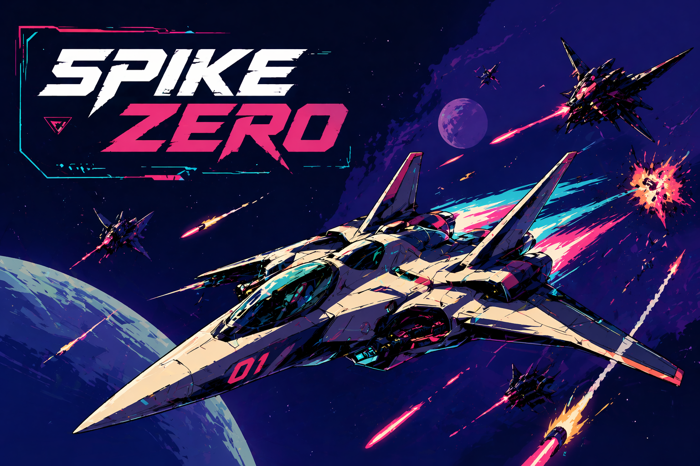
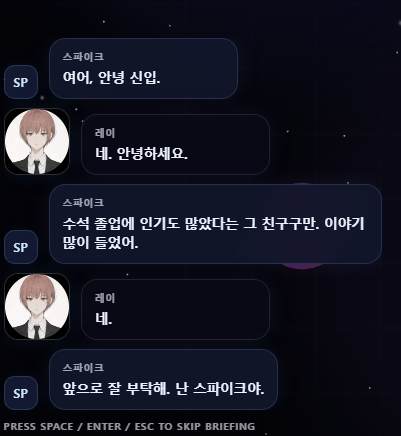
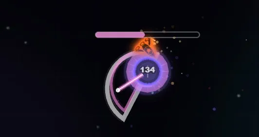
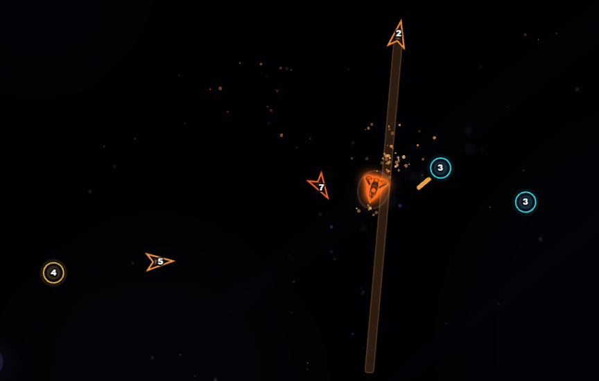
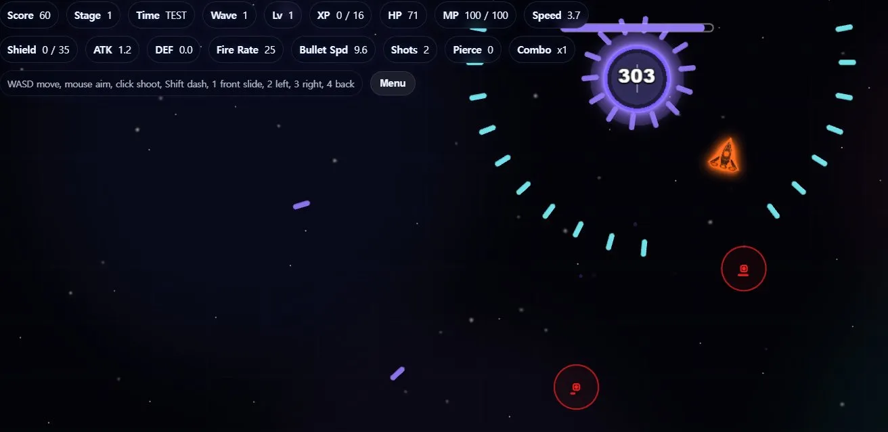

# SPIKE-ZERO

<p align="center">
  
</p>

`SPIKE-ZERO`는 브라우저에서 실행되는 PixiJS 기반 탑다운 아케이드 슈팅 게임입니다.  
플레이어는 스테이지를 돌파하며 업그레이드를 선택하고, 웨이브와 보스전을 넘기며 생존해야 합니다.

## 게임 특징

- WASD 이동, 마우스 조준, 클릭 사격 기반의 즉각적인 전투
- 스테이지별 웨이브, 보스, 배경 음악 구성
- 무기/패시브/액티브 스킬 업그레이드 선택
- Q/E/R 액티브 스킬 슬롯과 MP 시스템
- 관제사 브리핑, 보스 경고 연출, 스테이지 클리어 흐름
- 일반 플레이 모드와 보스/스테이지 테스트 모드

## 실행 방법

별도 빌드 과정 없이 정적 파일로 실행할 수 있습니다.

```text
index.html
```

브라우저에서 `index.html`을 열면 게임이 시작됩니다.  
PixiJS와 필터 라이브러리는 CDN을 사용하므로 인터넷 연결이 필요합니다.

## 조작

| 입력 | 동작 |
| --- | --- |
| WASD | 이동 |
| 마우스 | 조준 |
| 좌클릭 | 사격 |
| Shift | 대시 |
| Q / E / R | 액티브 스킬 |
| 1 / 2 / 3 / 4 | 방향 슬라이드 |
| Esc / P | 일시정지 |

## 게임 화면

|  |  |
| --- | --- |
|  |  |
|  |  |

## 프로젝트 구조

```text
assets/                 음악, 효과음, 캐릭터 이미지
css/                    화면 스타일
js/core/                부트스트랩, 상태, 공통 유틸
js/data/                밸런스, 무기, 업그레이드, 대사, 리소스 매니페스트
js/entities/            플레이어 등 게임 오브젝트
js/render/              배경과 시각 효과
js/systems/             전투, 웨이브, UI, 스킬, 사운드, 보스 시스템
lab/                    실험용 프로토타입
index.html              메인 게임
intro.html              인트로 화면
```

## 현재 상태

프로토타입을 넘어 플레이 루프, 스테이지 진행, 보스전, 업그레이드, 사운드, 브리핑 연출이 들어간 상태입니다.  
밸런스와 대사, UI 연출은 계속 다듬는 중입니다.
